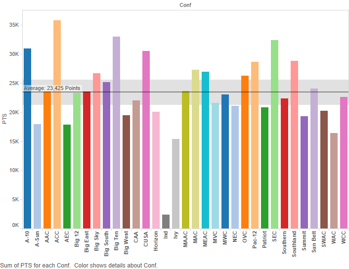
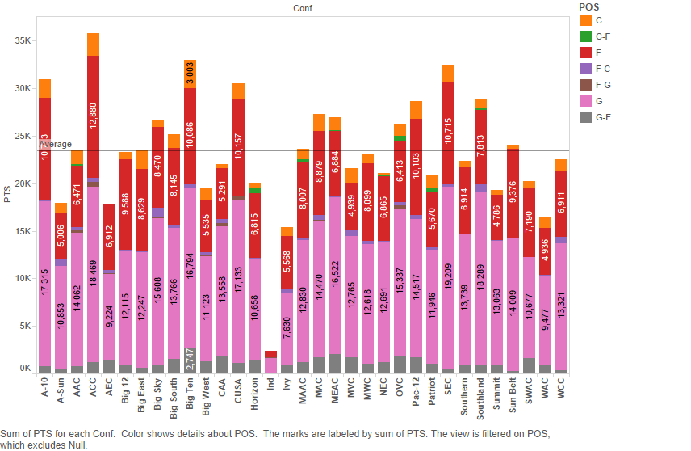
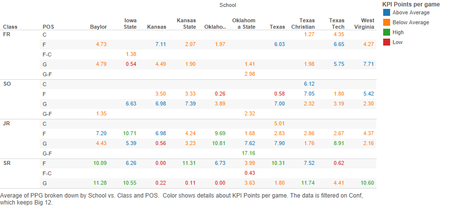
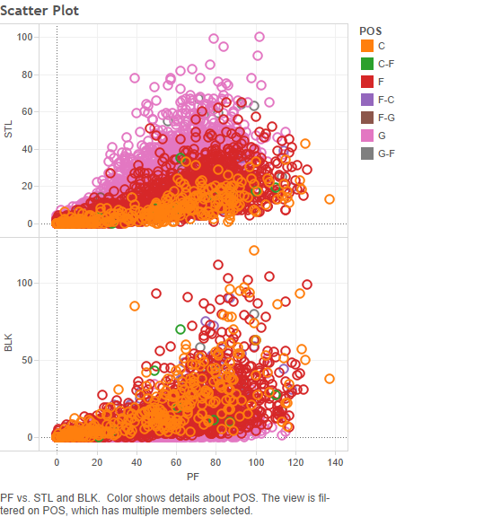

  Data Visualization Project 4 & 5: NCAA Division I Men's Basketball Statistics for the 2014-2015 Season
===
  **Bryan Amaefule, Shannon Lu, Kevin Lee**
  
  It's officially November, meaning the start of the college basketball season is just a few weeks away. Last season we saw Duke coach Mike Krzyzewski(yes, that's really how you spell his name) lead his Blue Devils to their sixteenth Final Four appearance, and their fifth National Championship. We saw the (almost)undefeated Kentucky Wildcats have their dream of a perfect season, and spot in the history books, cut short by Frank Kaminsky and the Wisconsin Badgers. With the drama of the 2015-2016 season on the horizon it was only fitting that we choose a baketball-centric subject for this project. We acquired statistic from the 2014-2015 season of NCAA Division I Men's Basketball.

**Background Information** 

To begin with, here are the statistics supplied in the datset and their abbreviations
  
  AST=Assists 
  
  BLK=Blocks 
  
  DRB=Defensive Rebounds 
  
  FG=Field Goals Made 
  
  FGA=Field Goal Attempts  
  
  FT=Free Throws Made 
  
  FTA=Free Throws Attempted 
  
  G=Games played 
  
  MP=Minutes Played 
  
  ORB=Offensive Rebounds 
  
  PF=Personal Fouls 
  
  PTS=Total Points Scored 
  
  STL=Steals 
  
  ThreeP=Three Pointers Made 
  
  ThreePA=Three Pointers Attempted 
  
The dataset includes other information about the players such as: the school they play for, the conference they play in, the position(s) they play, and their classification(freshman, sophomore, etc.) 

It takes a good amount of skill and talent to make it on to a Division I college basketball team, it also takes quite a bit of versitility. As such, many players have developed skillsets suitable to play more than one position. Players who play multiple positions have primary position listed first then their secondary position, separated by a hyphen. So a player whose position say 'F-C' is primarily a Forward but can switch over to the center position. And a player whose position says 'C-G' is probably Anthony Davis and thus way too good to be playing college basketball in the first place.


**Visualizations** 
```{r, warning=FALSE, message=FALSE }
source("../03 R SQL Visualizations/Setup.R", echo=TRUE)
```
**Points By Division**
There are two big barometers in determining how successful a team is: how good are their players? and how tough was their competition? A team with a winning record in some conference full of scrubs like the AEC, isn't going to get the same credit or recognition as a team who battled it out through the grueling SEC or ACC conferences. To get a look at just how these conferences stack up against each other, we've created a bar chart of the total points scored by the schools in each division using the average amount of points and the 95% confidence interval as a reference line.

  
  
We can see the conferences that stand out above the rest. The ACC with powerhouses like Duke, North Carolina, Virginia, and Louisville; and the SEC with the 38-1 Kentucky Wildcats. And if you look *right* on the reference line you'll see the Big 12 conference, home to the University of Texas at Austin, sitting perfectly at the average.

We recreate this graph using ggplot2, the axes are flipped so that the conference names are readable.
```{r, warning=FALSE, message=FALSE }
source("../03 R SQL Visualizations/PointsBYDivison.R", echo=TRUE)
```

**Points By Position**
Prior to the NBA Draft, the two most talked about prospects were Duke's Jahlil Okafor and Kentucky's Karl-Anthony Towns, who both happen to be 7-foot tall, 260 pound athletic freaks-of-nature. However, the Los Angeles Lakers broke-away from their history of drafting big men, and selected Ohio State University's 6'5 point guard D'Angelo Russell with the number 2 pick. The Laker's front office caught a lot of flak for not "going big", and only time will tell whether or not they made the right choice. For now, we can visualize the scoring contributions in college basketball by adding the 'position' dimension to color on the previous bar chart. 

  
  
We can see that a bulk of the scoring comes from Guard and Forward positions with the Centers putting up a few points here and there.  


We once again recreate this graph using ggplot2 with flipped axes.
```{r, warning=FALSE, message=FALSE }
source("../03 R SQL Visualizations/PointsByPosition.R", echo=TRUE)
```

**Points By Position and Classification in the Big 12**
Narrowing our view down to just the Big 12 conference, we can create a crosstab of the average points per game, broken down by school, classification, and position. 

   
  
We use a key performance indicator to classify the scoring performance according to where they fit within the quartiles. Scoring performances within the first quartile are labelled "Low", second quartile labelled "Below Average", third quartile labelled "Above Average", and fourth quartile labelled "High". Keep in mind that these are averages for ALL players at each position, so a performance like Myles Turners's 10.15 points per game would be averaged with fellow Freshman Forward Jordan Barnett's 1.90 points per game. 


While the scoreboard ultimately decides who wins or loses the ball game, there is much more to the game of basketball than just scoring points. Players can make their mark on the stat sheets on both offense and defense contributing through assists, rebounds, blocks, and steals.  


Recreating this crosstab using ggplot proved to be challenging due to the multiple variables used on the y-axis. For our ggplot rendition, we've split the data int two crosstabs. One highlighting player's positions and the other highlighting their classification

```{r, warning=FALSE, message=FALSE }
source("../03 R SQL Visualizations/ClassCrosstab.R", echo=TRUE)
```

```{r, warning=FALSE, message=FALSE }
source("../03 R SQL Visualizations/PosCrosstab.R", echo=TRUE)
```


**Assists and Rebounds by Position**
Offensively, players can facilitate by creating scoring opportunities for their teammates and racking up assists. Taller, more athletic players can also snag rebounds of a missed shot, allowing the team another chance at scoring. We plot both the assist and rebound numbers of each player against the amount of minutes they played. To provide a little more insight into how each role contributes, we color each point of the scatter plot by position.  

   
  
It can be seen from the scatter plots that guards facilitate for their teammates at a much higher rate than forwards or centers. This is why a talented guard like D'Angelo Russell can get picked second overall in the draft in front of taller, more athletic players. The revesre seems to be true for rebounds, as the centers and forwards towering over the competition are able to snag the most rebounds off missed shots. 

```{r, warning=FALSE, message=FALSE }
source("../03 R SQL Visualizations/AssistsRebounds.R", echo=TRUE)
```

**Steals and Blocks by Position**
A similar trend appears in the defensive statistics as the quick, dextruous guards are able to steal the ball by playing the passing lanes or just plain ripping the ball from the guy they're defending. The towering big men, clogging up the area around the basket are more adept at swatting shots that come their way. They block more shots than their less vertically-gifted couterparts. 

  
  
  
  
```{r, warning=FALSE, message=FALSE }
source("../03 R SQL Visualizations/StealsBlocks.R", echo=TRUE)
```